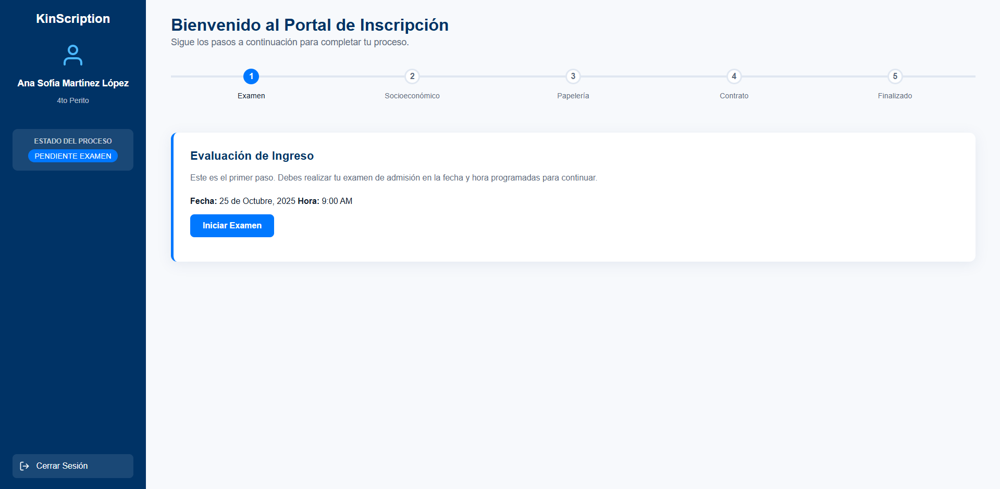
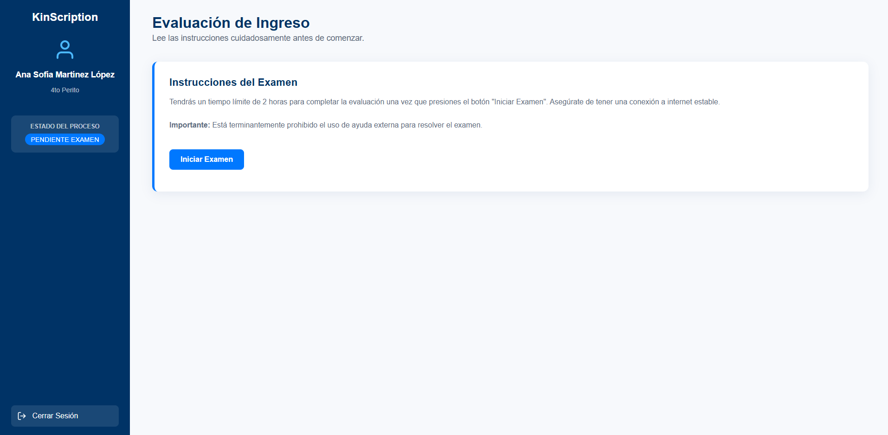
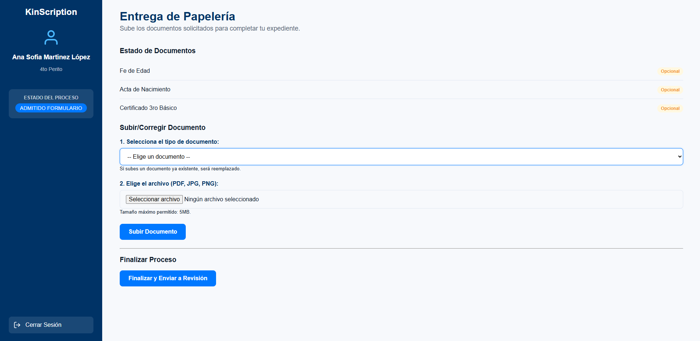
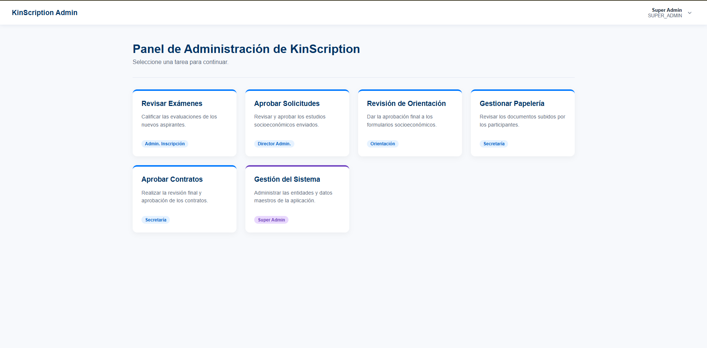
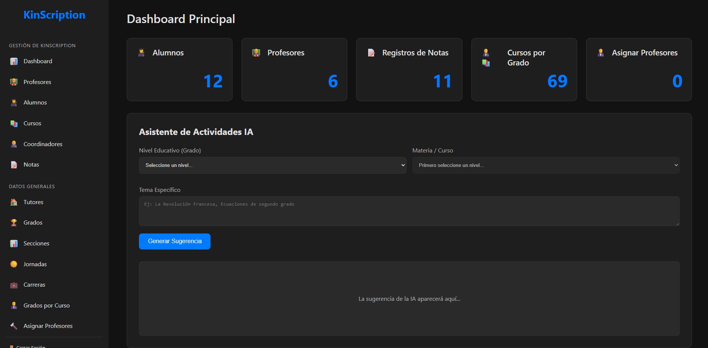
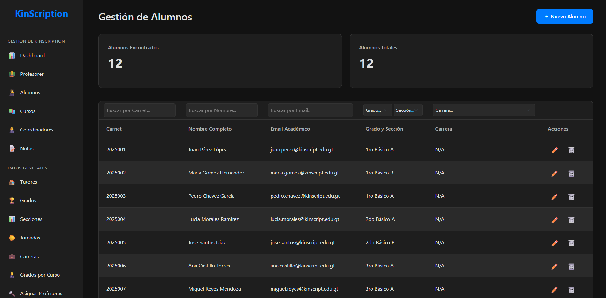
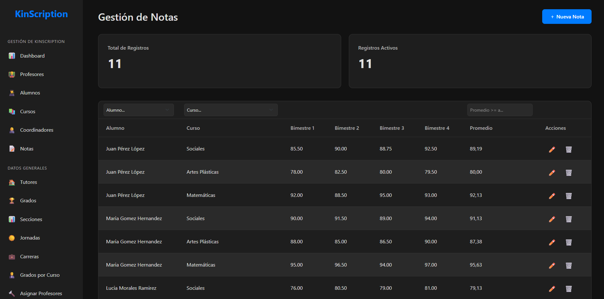
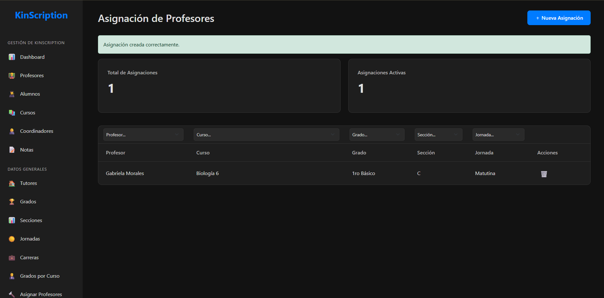

# 🎓 KinScription

<div align="center">

**Sistema Integral de Gestión Escolar y Proceso de Admisión**

[](https://spring.io/projects/spring-boot)
[](https://www.oracle.com/java/)
[](https://www.mysql.com/)
[](https://www.thymeleaf.org/)

</div>

---

## 📋 Descripción

**KinScription** es una aplicación web completa desarrollada con Spring Boot que automatiza y digitaliza la gestión escolar de una institución educativa. El sistema integra el proceso completo de inscripción de nuevos estudiantes, desde la evaluación inicial hasta la conversión a alumno activo, además de proporcionar herramientas de administración académica para la gestión diaria del centro educativo.

---

## ✨ Características Principales

### 🔐 Sistema de Autenticación y Roles

- **Autenticación segura** con Spring Security
- **Gestión de roles** con diferentes niveles de acceso:
  - Participantes (aspirantes a estudiantes)
  - Administradores
  - Director
  - Orientación
  - Secretaría
  - Coordinadores
  - Profesores
  - Super Administrador

### 📝 Proceso de Inscripción Automatizado

El sistema guía a los aspirantes a través de un proceso de inscripción por etapas:

1. **Examen de Admisión**
   - Evaluación de ingreso programada
   - Calificación automática del examen
   - Aprobación/rechazo basado en nota mínima (≥60)

2. **Estudio Socioeconómico**
   - Formulario digital completo
   - Revisión por Director
   - Aprobación por Orientación

3. **Entrega de Papelería**
   - Sistema de carga de documentos requeridos
   - Validación de documentos por tipo
   - Revisión y aprobación por Secretaría
   - Soporte para PDF, JPG y PNG

4. **Firma de Contrato**
   - Carga del contrato firmado
   - Revisión final por Secretaría

5. **Finalización**
   - Conversión automática a Alumno
   - Generación de reporte de pagos (inscripción + 10 mensualidades)
   - Asignación de credenciales y acceso al sistema

### 🎯 Dashboard Personalizado

- **Dashboard del Participante**: Visualización del progreso en el proceso de inscripción con barra de progreso visual
- **Dashboard Administrativo**: Panel de control para gestión y supervisión de procesos

### 👥 Gestión Académica Completa

#### Gestión de Personal
- **Profesores**: CRUD completo con asignación de cursos
- **Coordinadores**: Administración de coordinadores académicos
- **Tutores**: Gestión de tutores de estudiantes
- **Administradores**: Control de usuarios administrativos

#### Gestión Curricular
- **Grados**: Administración de niveles educativos
- **Carreras**: Gestión de carreras técnicas (para Bachillerato)
- **Cursos**: Catálogo completo de materias
- **Secciones**: Organización de grupos por grado y jornada
- **Jornadas**: Configuración de horarios (Matutina, Vespertina, etc.)
- **Asignación Grado-Curso**: Vinculación de cursos con grados específicos
- **Asignación Profesor-Curso**: Distribución de carga académica

#### Gestión de Estudiantes
- **Alumnos**: CRUD completo de estudiantes activos
- **Notas**: Sistema de registro y consulta de calificaciones
- **Expedientes**: Historial académico completo

### 💰 Sistema de Pagos

- **Generación automática de reportes de pago** al finalizar inscripción
- **Gestión de pagos**: Inscripción y 10 cuotas mensuales
- **Seguimiento de pagos** por estudiante

### 📄 Gestión Documental

- **Almacenamiento de documentos** de participantes y alumnos
- **Sistema de archivos** organizado por categorías
- **Validación de tipos de archivo** (PDF, JPG, PNG)
- **Límite de tamaño**: 5MB por archivo

### 🔄 Gestión de Ciclos Académicos

- Control de períodos lectivos
- Configuración de ciclos escolares

### 🤖 Integración con IA

- **Asistente AI** integrado con LangChain4j y OpenAI
- API REST para consultas inteligentes

---

## 🛠️ Tecnologías Utilizadas

### Backend
- **Java 21** - Lenguaje de programación
- **Spring Boot 3.5.6** - Framework principal
- **Spring Data JPA** - Persistencia de datos
- **Spring Security** - Autenticación y autorización
- **Spring Validation** - Validación de datos
- **Hibernate** - ORM

### Frontend
- **Thymeleaf** - Motor de plantillas
- **Thymeleaf Layout Dialect** - Layouts reutilizables
- **Thymeleaf Spring Security** - Integración de seguridad en vistas
- **HTML5/CSS3** - Interfaz de usuario
- **JavaScript** - Interactividad

### Base de Datos
- **MySQL** - Sistema de gestión de base de datos

### Herramientas Adicionales
- **Lombok** - Reducción de código boilerplate
- **Maven** - Gestión de dependencias
- **LangChain4j** - Integración con modelos de IA (OpenAI)

---

## 📦 Requisitos Previos

- **Java Development Kit (JDK) 21** o superior
- **MySQL 8.0** o superior
- **Maven 3.6+** (o usar el wrapper incluido `mvnw`)
- **Git** para clonar el repositorio

---

## 🚀 Instalación y Configuración

### 1. Clonar el Repositorio

```bash
git clone https://github.com/ksolo-2022439/KinScription.git
cd KinScription
```

### 2. Configurar Base de Datos

Crea una base de datos MySQL:

```sql
CREATE DATABASE KinScription;
```

**Nota:** El sistema puede crear la base de datos automáticamente si configuras `createDatabaseIfNotExist=true` en la URL de conexión.

### 3. Configurar Credenciales

Edita el archivo `src/main/resources/application.properties` y ajusta las credenciales:

```properties
spring.datasource.url=jdbc:mysql://localhost:3306/KinScription?createDatabaseIfNotExist=true&allowPublicKeyRetrieval=true&useSSL=true&serverTimezone=UTC
spring.datasource.username=tu_usuario
spring.datasource.password=tu_contraseña
```

### 4. Configurar API de OpenAI (Opcional)

Si deseas utilizar las funcionalidades de IA, configura tu API key:

```properties
langchain4j.open-ai.chat-model.api-key=tu_api_key
```

### 5. Compilar y Ejecutar

**Usando Maven Wrapper (recomendado):**

```bash
# En Linux/Mac
./mvnw clean install
./mvnw spring-boot:run

# En Windows
mvnw.cmd clean install
mvnw.cmd spring-boot:run
```

**Usando Maven instalado:**

```bash
mvn clean install
mvn spring-boot:run
```

### 6. Acceder a la Aplicación

Abre tu navegador y visita:

```
http://localhost:8080
```

---

## 📁 Estructura del Proyecto

```
KinScription/
├── src/
│   ├── main/
│   │   ├── java/
│   │   │   └── com/ksolorzano/KinScription/
│   │   │       ├── config/           # Configuraciones de Spring
│   │   │       ├── dominio/
│   │   │       │   ├── repository/   # Repositorios JPA
│   │   │       │   └── service/      # Lógica de negocio
│   │   │       ├── persistence/
│   │   │       │   └── entity/       # Entidades JPA
│   │   │       └── web/
│   │   │           └── controller/   # Controladores MVC
│   │   │               ├── api/      # APIs REST
│   │   │               ├── crud/     # Controladores CRUD
│   │   │               └── gestion/  # Gestión administrativa
│   │   └── resources/
│   │       ├── static/               # CSS, JS, archivos estáticos
│   │       ├── templates/            # Plantillas Thymeleaf
│   │       │   ├── admin/           # Vistas administrativas
│   │       │   ├── portal/          # Portal de participantes
│   │       │   └── gestion/         # Gestión escolar
│   │       ├── application.properties
│   │       └── data.sql             # Datos iniciales
│   └── test/                         # Tests unitarios
├── upload-dir/                       # Almacenamiento de archivos
├── pom.xml                           # Configuración Maven
└── README.md
```

---

## 👤 Roles y Permisos

### Participante
- Acceso al dashboard de inscripción
- Realización de examen de admisión
- Llenado de formulario socioeconómico
- Carga de documentos requeridos
- Firma y carga de contrato

### Director
- Revisión de estudios socioeconómicos
- Aprobación/rechazo de participantes

### Orientación
- Revisión final de formularios socioeconómicos
- Aprobación para continuar a papelería

### Secretaría
- Revisión de documentación (papelería)
- Revisión de contratos
- Aprobación final para conversión a alumno

### Administradores
- Calificación de exámenes de admisión
- Acceso a módulos de gestión académica

### Coordinador
- Gestión de cursos y secciones
- Supervisión académica

### Profesor
- Registro de notas
- Consulta de asignaciones

### Super Administrador
- Acceso completo al sistema
- Gestión de usuarios y roles
- Configuración de ciclos académicos

---

## 🔄 Flujo del Proceso de Inscripción

```
Registro de Participante
         ↓
    Examen de Admisión
         ↓
    Calificación (≥60)
         ↓
  Formulario Socioeconómico
         ↓
   Revisión por Director
         ↓
  Aprobación por Orientación
         ↓
   Entrega de Papelería
         ↓
  Revisión por Secretaría
         ↓
    Firma de Contrato
         ↓
  Revisión Final
         ↓
  Conversión a Alumno
         ↓
 Generación de Pagos
```

---

## 📸 Capturas de Pantalla

<!-- Aquí se pueden agregar capturas de pantalla del sistema -->

### Dashboard del Participante


### Proceso de Examen


### Gestión de Papelería


### Panel Administrativo




### Gestión de Alumnos


### Sistema de Notas


### Asignación de Profesores


---

## 🤝 Contribuciones

Este proyecto está en desarrollo activo. Para contribuir:

1. Haz fork del repositorio
2. Crea una rama para tu feature (`git checkout -b feature/nueva-funcionalidad`)
3. Realiza tus cambios y commitea (`git commit -am 'Agrega nueva funcionalidad'`)
4. Push a la rama (`git push origin feature/nueva-funcionalidad`)
5. Crea un Pull Request

---

## 📝 Licencia

Este proyecto es de código privado. Todos los derechos reservados.

---

## 👨‍💻 Autor

- **GitHub:** [@ksolo-2022439](https://github.com/ksolo-2022439)

---

## 📧 Contacto

Para preguntas o soporte, abre un issue en el repositorio de GitHub.

---

<div align="center">

**Desarrollado con ❤️ usando Spring Boot**

⭐ Si este proyecto te resulta útil, considera darle una estrella

</div>
